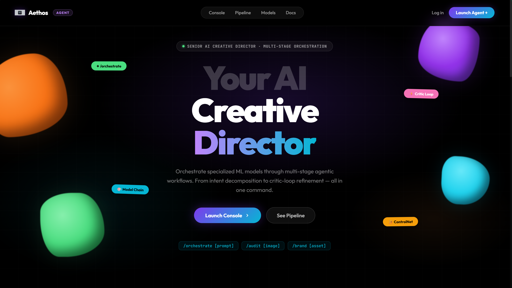
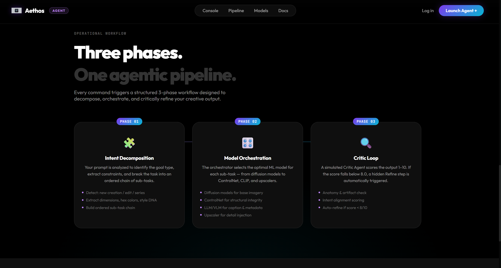
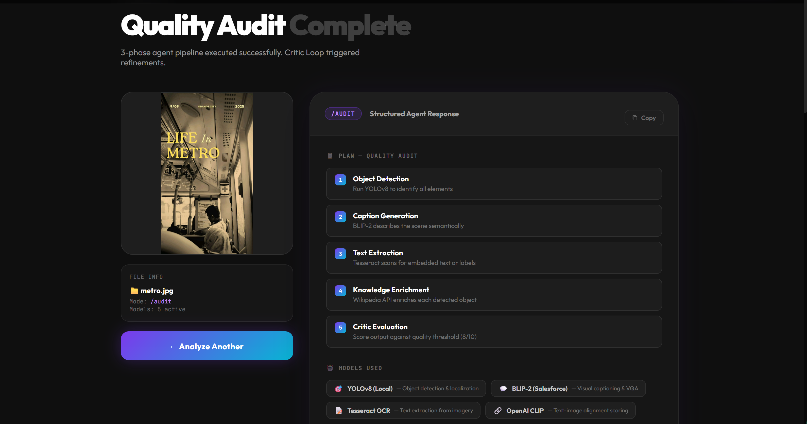
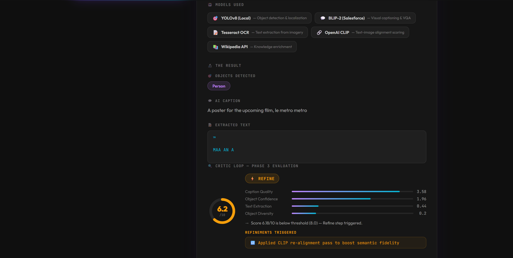

# AETHOS-AI-IMAGE-ARCHITECT
# AETHOS: Agentic Image Architect

A sophisticated, multi-stage AI orchestration system designed to manage complex creative workflows through a terminal-inspired interface. It integrates state-of-the-art machine learning models for object detection, image captioning, and OCR, coordinated by a deterministic "Critic Loop" agent.

---

## 🚀 Overview

AETHOS (Agentic Image Architect) transforms plain visual data into actionable creative insights. It allows users to orchestrate, audit, and brand visual content using advanced AI agents that plan and execute multi-model pipelines.

---

## ✨ Key Features

- **Multi-Model Orchestration**: Leverages YOLOv8, BLIP, and Tesseract for deep visual understanding
- **Agentic Slash Commands**:
  - `/orchestrate`: Plan creative workflows without an initial image
  - `/audit`: Perform a quality and content audit on uploaded images  
  - `/brand`: Adapt visual descriptions to specific brand guidelines
- **Critic Loop integration**: Every plan is scrutinized by a deterministic critic to ensure quality and relevance
- **Knowledge Enrichment**: Automatically fetches context from Wikipedia for detected objects
- **Premium Interface**: A sleek, terminal-inspired bento-grid layout for a professional creative feel

---

## 🛠️ Technology Stack

- **Backend**: Python, Flask
- **Computer Vision**: 
  - `ultralytics` (YOLOv8) for Object Detection
  - `transformers` (BLIP) for Image Captioning
  - `pytesseract` for Optical Character Recognition (OCR)
- **Data Enrichment**: `geopy`, Wikipedia API
- **Frontend**: Vanilla HTML5, CSS3, JavaScript (Modern ES6+)

---

## 📂 Project Structure

```text
AETHOS/
│
├── app.py                     # Main Flask Application & Routes
├── requirements.txt           # Python Dependencies
├── README.md                  # Project Documentation
├── LICENSE                    # MIT License
│
├── services/                  # Core AI modules
│   ├── object_detection.py    # YOLOv8 Object Detection
│   ├── ocr_service.py         # Tesseract OCR
│   ├── wiki_service.py        # Wikipedia API Integration
│   ├── capture_service.py     # BLIP Image Captioning
│   └── agent_service.py       # AI Agent Orchestration
│
├── models/                    # Pre-trained Models
│   ├── yolov8n.pt            # YOLOv8 Nano
│   ├── yolov8m.pt            # YOLOv8 Medium
│   └── yolov8l.pt            # YOLOv8 Large
│
├── static/                    # Frontend Assets
│   ├── css/
│   │   └── style.css         # Main Stylesheet
│   ├── js/
│   │   └── main.js           # JavaScript Functionality
│   └── uploads/              # User Uploads
│
├── templates/                 # HTML Templates
│   ├── index.html            # Main Interface
│   └── result.html           # Results Display
│
├── screenshots/              # Application Screenshots
│   ├── homepage.png
│   ├── analysis_result.png
│   └── workflow.png
│
└── docs/                     # Documentation
    └── architecture.md       # System Architecture
```

---

## ⚙️ Installation

### Prerequisites
- **Python 3.10+**
- **Tesseract OCR**: [Download from UB Mannheim](https://github.com/UB-Mannheim/tesseract/wiki)

### Quick Setup
```bash
git clone <repository-url>
cd AETHOS
python -m venv .venv
source .venv/bin/activate  # Windows: .venv\Scripts\activate
pip install -r requirements.txt
python app.py
```

### Model Download
YOLOv8 models download automatically on first run, or manually:
- `yolov8n.pt` (6MB) - Fast detection
- `yolov8m.pt` (52MB) - Balanced accuracy
- `yolov8l.pt` (87MB) - High accuracy

---

## 🏃 Running the Project

```bash
python app.py
```

Navigate to `http://127.0.0.1:5000`

---

## 📖 Usage Guide

### Commands
- **Full Analysis**: Upload image → `/analyze` or Enter
- **Creative Planning**: `/orchestrate design a futuristic watch ad`
- **Quality Audit**: Upload image → `/audit`
- **Brand Adaptation**: `/brand apple` to analyze brand fit

---

## 🌐 API Endpoints

### POST /upload
Upload an image for analysis.
```json
{
  "file": "image_file",
  "command": "/analyze"
}
```

### POST /analyze
Runs the multi-model AI pipeline.
```json
{
  "image": "uploaded_file",
  "command": "/analyze"
}
```

### POST /audit
Performs image quality analysis.
```json
{
  "image": "uploaded_file",
  "command": "/audit"
}
```

### POST /brand
Adapts visual descriptions to brand style.
```json
{
  "prompt": "brand_name",
  "command": "/brand apple"
}
```

---

## 🎯 Skills Demonstrated

• **AI System Design** - Multi-model orchestration architecture
• **Computer Vision** - YOLOv8 object detection and BLIP captioning
• **Optical Character Recognition** - Tesseract OCR integration
• **REST API Development** - Flask backend with comprehensive endpoints
• **AI Workflow Orchestration** - Agent-based planning and execution
• **Data Enrichment** - Wikipedia API integration for context
• **Frontend Development** - Modern ES6+ JavaScript with responsive design

---

## 🚀 Future Improvements

• Add OpenAI GPT integration for advanced reasoning
• Deploy using Docker containers for production
• Implement real-time video analysis capabilities
• Add user authentication and session management
• Integrate cloud storage for image persistence
• Develop mobile app interface
• Add support for additional image formats
• Implement batch processing for multiple images

---

## 📸 Application Demo







---

## 🏗️ System Architecture



---

## 🛡️ License

Distributed under the MIT License. See `LICENSE` for more information.
